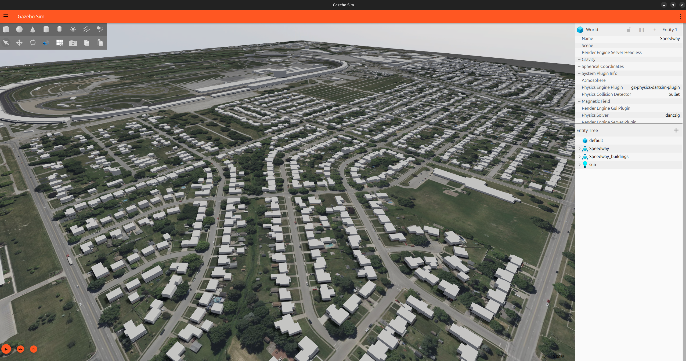

# Gazebo Terrain Generator

A web-based tool that generates self-contained [Gazebo Harmonic](https://gazebosim.org/docs/harmonic/) worlds from real-world satellite imagery and elevation data. Draw a polygon on a map, set a spawn location, and get a ready-to-use `.world` file with a textured heightmap and optional 3D buildings.

Developed by [Karinca Robotics](https://karinca.com.tr) for [Polymath Robotics](https://polymathrobotics.com).
Originally forked from [saiaravind19/gazebo_terrain_generator](https://github.com/saiaravind19/gazebo_terrain_generator).

<p align="center">
  
</p>

<p align="center">
  
</p>

<video src="https://github.com/user-attachments/assets/42289e73-c66a-4605-85c6-c95d13139d44" controls width="100%"></video>

---

## Features

- Draw a polygon on a live satellite map to select any area on Earth
- Real-world elevation data via Mapbox Terrain-DEM-v1 (SRTM ~30m resolution)
- Satellite imagery texture stitched from configurable tile sources
- 16-bit heightmap for ~0.008m elevation precision
- Normal map generated from heightmap gradients for realistic terrain shading
- Optional 3D buildings from OpenStreetMap footprints
- Configurable spawn location — robot spawns with correct GPS coordinates at world origin
- Downloadable zip with world file, terrain data, and optionally raw tiles

---

## Requirements

- Python 3.12+
- [Gazebo Harmonic](https://gazebosim.org/docs/harmonic/install_ubuntu/) or above
- A [Mapbox account](https://www.mapbox.com/) with a public access token (free tier is sufficient)

---

## Setup

```bash
# Clone the repository
git clone <repo-url>
cd gazebo_terrain_generator

# Create and activate a virtual environment
python3 -m venv venv
source venv/bin/activate

# Install dependencies
pip install -r requirements.txt
```

---

## Running

```bash
source venv/bin/activate
python scripts/server.py
```

Then open [http://localhost:8080](http://localhost:8080) in your browser.

---

## Mapbox API Key

A Mapbox public access token is required for satellite imagery, elevation data, and geocoding.

1. Create a free account at [mapbox.com](https://www.mapbox.com/) and copy your public token (`pk.eyJ1...`)
2. In the web UI, open **Settings** → click the **Mapbox API Key** field
3. Paste your token and click **Save** — it is validated immediately and stored in your browser only

The key is never stored server-side.

---

## Usage

1. **Search** — type a place name or GPS coordinates (`lat, lng`) in the search box
2. **Draw** — use the polygon tool to outline your area of interest on the map
3. **Set spawn location** — drag the pin to where your robot should spawn
4. **Configure** (optional) — open Settings to adjust zoom level, tile source, buildings toggle
5. **Generate** — click **Generate Terrain**, name your world, and watch the console
6. **Download** — once complete, click **Download World** to get a zip file

---

## Settings

| Setting | Default | Description |
|---|---|---|
| Zoom Level | 17 | Satellite tile zoom (higher = more detail, more tiles) |
| Include Buildings | On | Download OSM building footprints and extrude as 3D meshes |
| Map Tile Source | Bing Aerial | Satellite tile provider URL template |
| Parallel Downloads | 4 | Concurrent tile download threads |

---

## Output Structure

Generated files are stored under `/tmp/gazebo_terrain_generator/{world_name}/`:

```
{world_name}/
  {world_name}.world      — self-contained Gazebo world file
  metadata.json           — generation parameters (bounds, zoom, spawn location, etc.)
  terrain_data/
    aerial.png            — stitched satellite texture
    height_map.png        — 16-bit grayscale heightmap
    normal_map.png        — normal map derived from heightmap
    buildings.dae         — 3D building mesh (if buildings enabled and OSM data exists)
    buildings.geojson     — raw building footprints (if buildings enabled)
  tiles/                  — raw satellite tiles (included in zip if "Include raw tiles" checked)
  dem/                    — raw DEM tiles (included in zip if "Include raw tiles" checked)
  building_tiles/         — raw vector tile cache (included in zip if "Include raw tiles" checked)
```

---

## Opening in Gazebo

Run directly:

```bash
gz sim /tmp/gazebo_terrain_generator/{world_name}/{world_name}.world
```

Or unzip the downloaded archive anywhere and run:

```bash
gz sim {world_name}/{world_name}.world
```

---

## Tile Source URLs

The default tile source is Bing Aerial. Other providers can be entered manually using URL templates with `{x}`, `{y}`, `{z}` or `{quad}` placeholders. Check your provider's terms of service before use — some providers (Google, Bing, ESRI) restrict commercial use without a license agreement.

---

## License

BSD 3-Clause License. See [LICENSE](LICENSE) for details.

This project incorporates work from:
- [saiaravind19/gazebo_terrain_generator](https://github.com/saiaravind19/gazebo_terrain_generator) — BSD 3-Clause
- [MapTilesDownloader](https://github.com/AliFlux/MapTilesDownloader) by Ali Ashraf — MIT